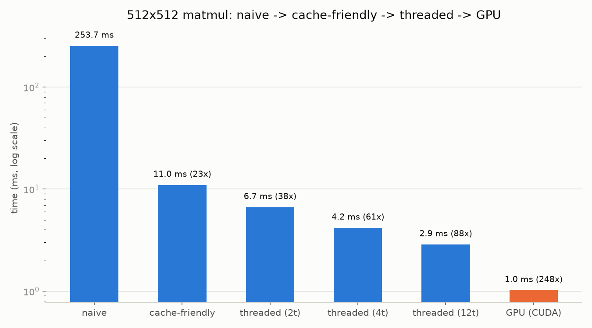

# Digit Recognizer → CUDA

A from-scratch C++ progression: a CPU MNIST digit-recognition inference engine,
optimized with cache-friendly access and multithreading, then ported to CUDA
and benchmarked CPU vs. GPU. Built stage by stage while learning C++ along the way.

## Stages

- [x] **Stage 1 — CPU inference engine**: matrix class + forward pass over a
      pretrained MNIST classifier. (96.8% test accuracy, matching the numpy
      reference model.)
- [x] **Stage 2 — Make it fast**: cache-friendly matmul + multithreading, benchmarked.
      (512x512 matmul: 254ms naive -> 11.0ms cache-friendly (23x) -> 2.9ms
      threaded on 12 cores (88x). See `results/benchmarks.csv`.)
- [x] **Stage 3 — CUDA port**: matmul kernel on GPU, CPU vs. GPU timings.
      (512x512 matmul: 1.0ms on a Colab T4 GPU vs. 254ms naive CPU — 248x, and
      ~300x vs. a single-threaded CPU reference run in the same program.
      Validated on a cloud GPU since this machine has none — see
      `stage3_cuda/README.md`.)
- [ ] **Stage 4 — Stretch: tiny language model** (llama2.c-style), only if time allows.

## Building

Requires CMake and a C++17 compiler (developed with MinGW-w64 g++ on Windows).

```
cmake -S . -B build -G "MinGW Makefiles"
cmake --build build
```

## Data / weights

`tools/train_export.py` trains a tiny MLP on MNIST with plain numpy and exports
raw weights + a handful of test images for the C++ engine to load:

```
pip install numpy
python tools/train_export.py
```

## Benchmarks



Raw numbers in `results/benchmarks.csv`. Regenerate the CPU-side numbers with:

```
./build/stage2_fast/stage2_benchmark.exe
python tools/make_chart.py
```

The GPU number comes from running `stage3_cuda/matmul.cu` on a cloud GPU (see
`stage3_cuda/README.md`) and is appended to `results/benchmarks.csv` by hand,
since it's a separate program running on separate hardware.
